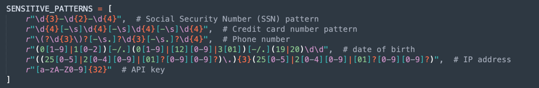
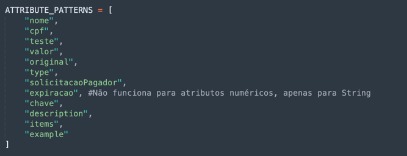
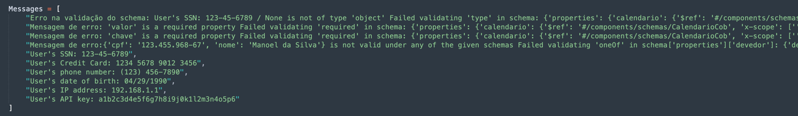
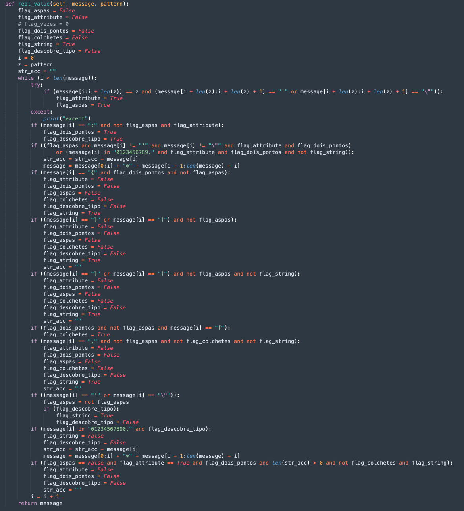
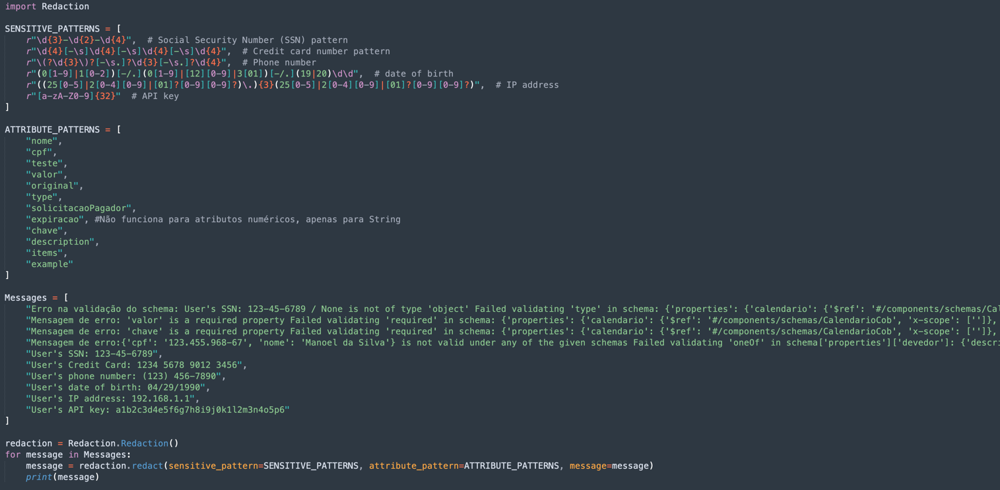
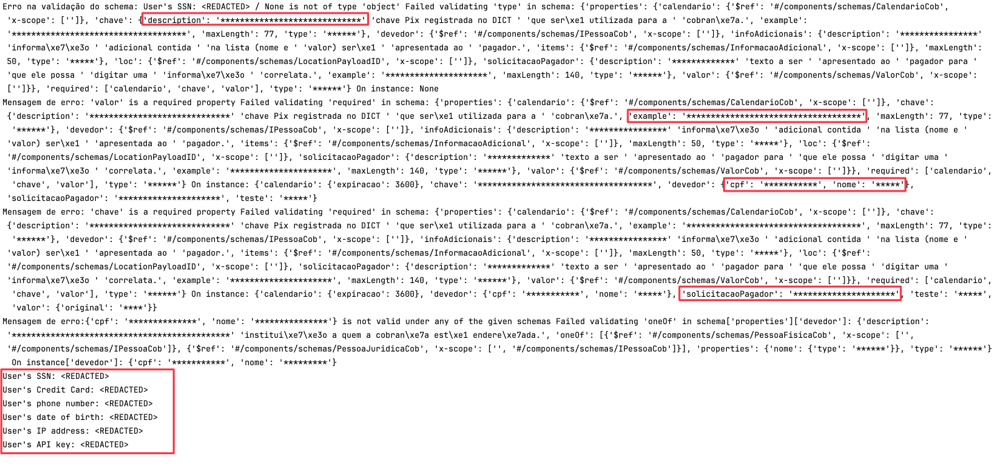

# Redact your Logs in Python

## Introduction

It often becomes necessary to hide the values of certain attributes in a String. The term for this process is called REDACTION.

There are several ways to do this in a JSON or XML String. We can find several tutorials to do this, but I came across a different case.

Although part of the String looks like a JSON structure, this String can come from an Error Log, which messes up the entire JSON structure and the codes I found don't work well in these situations.

I found a really cool tutorial:

[Secure Logging in Python: Redacting Sensitive Data with Filters](https://levelup.gitconnected.com/secure-logging-in-python-redacting-sensitive-data-with-filters-d49bd401c53)

This material provides us with code that deals with REGEX patterns and allows, regardless of whether we have a poorly formatted JSON (or any other) structure, it works anyway.

However, the material is well aimed at finding REGEX patterns, such as dates, credit card numbers, telephone numbers and other String formatting patterns.

But what about when we need to hide specific attributes?

I didn't find anything about it, so I decided to build a code that would also add this form of REDACTION to the tutorial above.

## Understand the Code

The code has two aspects:

- Act based on REGEX patterns

- Act based on attribute names

We can then, from a list of Strings (Logs for example), have a poorly formatted Strings:

This is the part of code has more logical complexity:

It works with flags:

- **flag_aspas**: Controls if the content is a string content between ''. It's important to find the attribute name ou if the attribute is part of a String content.
- **flag_attribute**: It marks that an attribute was found
- **flag_dois_pontos**: It marks that the algorithm is prepared to find the content of an attribute (the content is after the :)
- **flag_colchetes**: It marks that an attribute items values will be analyzed
- **flag_descobre_tipo**: It marks for find the type of an attribute (String or Numeric)
- **flag_string**: If True, the attribute will be a String; If False, it's a Numeric attribute

>**Note**: The attribute to be redacted could be a String, Numeric or Items (values between [ and ]). If the attribute is a set of attributes (between { and }), the algorithm will ignore all the set.

What the algorithm performs:

- The algorithm looks for **REGEX** patterns, therefore, no matter the name of the attribute or if there is an attribute associated with the name (in a JSON structure), the algorithm will always replace the value with **<REDACTED>**.
- The algorithm searches for the attribute name in the list (**ATTRIBUTE_PATTERNS**). This needs to be in the format:

    'name': 'value' 
    
    'name' is the attribute name
    
    : need to respect a JSON association
    
    'value' is the value between '' for a String, or a Numeric value (Integer or Double with a . and no '') 
    

So you can use the class **Redaction.py** in you code, like this:

## Test

Execute the Python code **redact.py**

